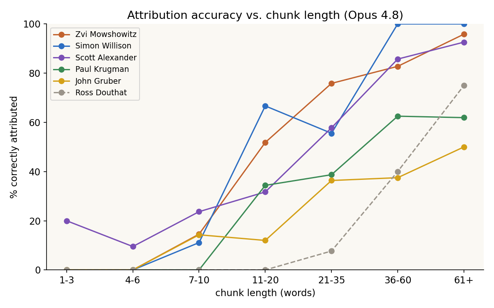
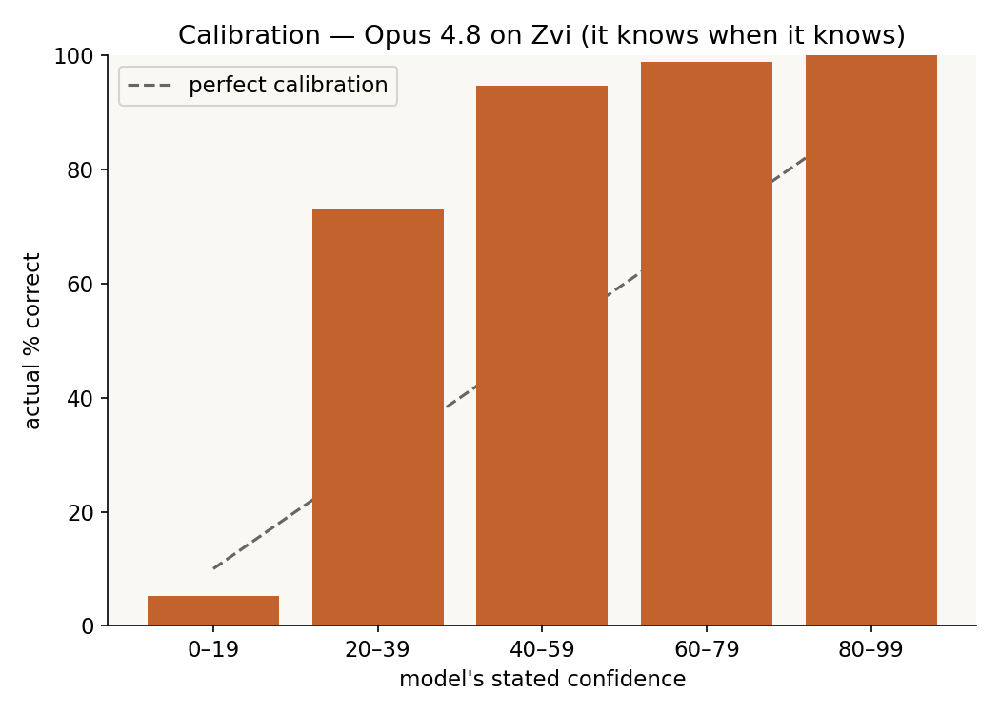
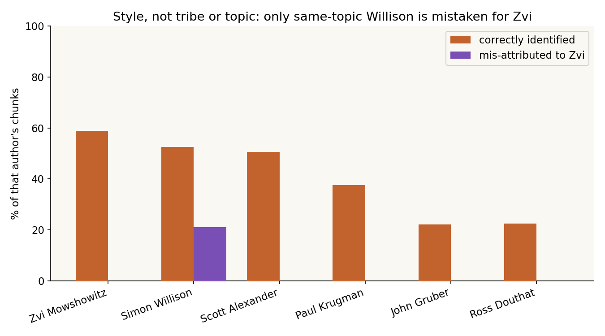
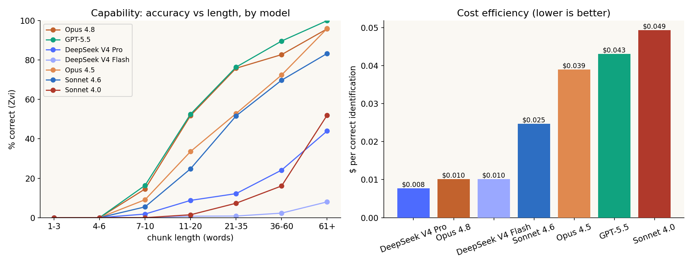
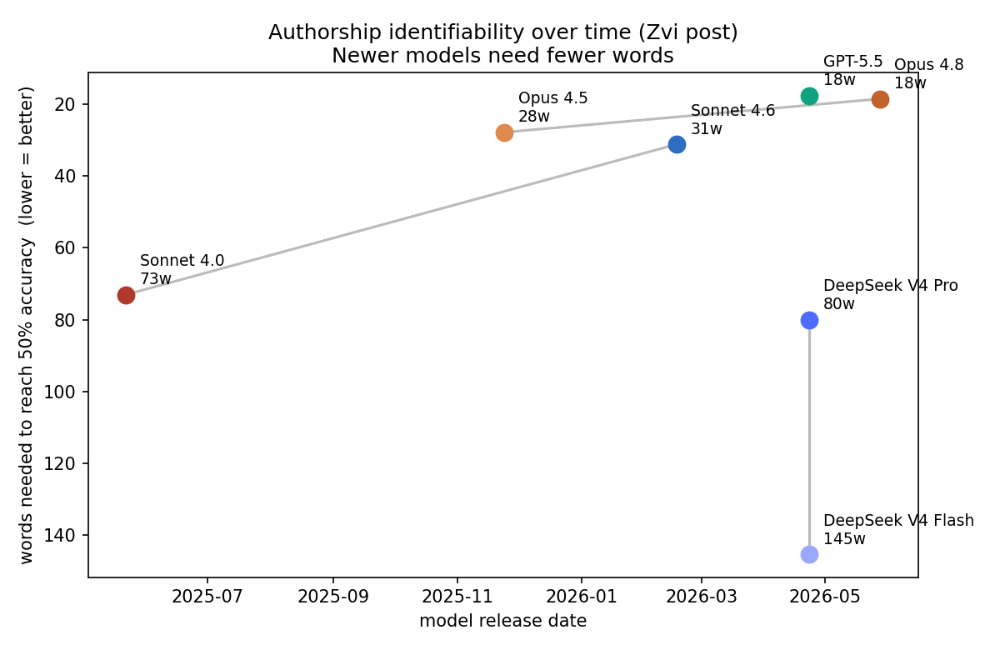
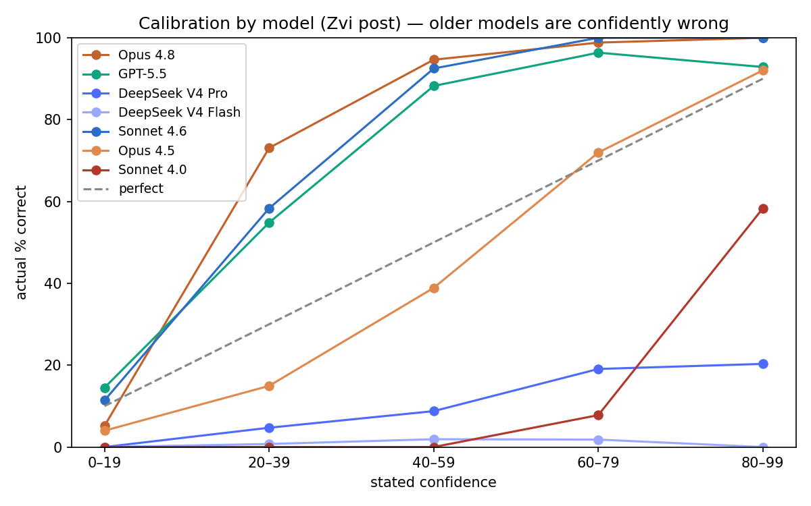

# How few words does a frontier model need to identify an author?

*An empirical study of open-ended authorship attribution by LLMs.*
*Seven models, six authors, ~3,800 attribution calls. Preliminary, single-pass.*

## The question

Give a model a chunk of text — a paragraph, or a single sentence — and ask, with
no tools and no web access, *"who wrote this?"* How short can the chunk be before
the model can no longer identify the author? Is it recognizing the author's
**style**, their intellectual **tribe**, or just the **topic**? And how do models
differ — across generations, vendors, and open vs. closed weights?

We test on articles published *after* each model's training cutoff (novel text),
with quotes and table-of-contents navigation stripped so only each author's own
prose is graded. Grading is a strict, precise-name match.

## Headline findings

1. **Accuracy is a steep, S-shaped function of word count.** For Zvi Mowshowitz,
   Opus 4.8 crosses 50% accuracy at **~18 words** and 80% at **~34 words**. Below
   ~10 words, no model can identify anyone.
2. **Frontier models are remarkably well-calibrated** — Opus 4.8, GPT-5.5, and
   Sonnet 4.6 are 96–100% correct when they report ≥60% confidence, and they
   abstain on fragments too short to identify.
3. **It's style, not tribe or topic.** A fellow LessWrong-sphere writer (Scott
   Alexander) was *never* mistaken for Zvi; the only author ever confused with Zvi
   was Simon Willison writing about the *same subject* — and even he was correctly
   identified most of the time.
4. **The capability improved sharply across generations** (Sonnet 4.0 → 4.6, Opus
   4.5 → 4.8), and so did calibration.
5. **Open-weights models badly trail the frontier here.** DeepSeek V4 Pro — a
   flagship *reasoning* model — reaches only 20% accuracy on ≥21-word chunks
   (Flash: 2%), versus 81–84% for Opus 4.8 / GPT-5.5. And both DeepSeek models are
   *confidently wrong* (≤19% correct when ≥60% confident).
6. **At the frontier it's a near-tie, but cost differs ~4×.** GPT-5.5 edges Opus
   4.8 on raw accuracy; Opus 4.8 matches it at **~¼ the cost per correct ID**.

---

## 1. Accuracy vs. chunk length

The independent variable is **word count** (paragraph vs. sentence is just a proxy
for length). The cleanest metric is the word count needed to cross 50% / 80%
accuracy:

**Table 1 — Opus 4.8, by author** (90% bootstrap CIs in brackets)

| author | work | chunks | words→50% | words→80% |
|---|---|---:|---:|---:|
| Zvi Mowshowitz | Claude Opus 4.8: The System Card | 450 | 18w [17–20] | 34w [30–37] |
| Simon Willison | Claude Opus 4.8 | 38 | 17w [13–21] | 26w [20–35] |
| Scott Alexander | Book Review: The Dialectical Imagination | 373 | 25w [22–28] | 44w [39–52] |
| Ross Douthat | The Best News in America | 49 | 60w [48–74] | 81w [61–106] |
| Paul Krugman | Europe Versus America: A Response… | 109 | 52w [38–75] | 102w [69–161] |
| John Gruber | What Is a Dickover? | 77 | 94w [59–148] | 157w [103–258] |

The AI/rationalist-sphere writers (Zvi, Willison, Scott: 17–25 words to 50%) are
identified ~2–3× faster per word than the mainstream columnists (52–94 words). Wide
CIs on Gruber/Krugman/Douthat reflect small samples and few long chunks — provisional.

## 2. Calibration — the model knows when it knows

Opus 4.8's confidence tracks reality almost perfectly: ≥60% confidence ⇒ ~99%
correct (n=110). The overall ~59% accuracy is dragged down entirely by short chunks
the model *correctly* flags as low-confidence or declines to attribute (it gives a
vague/non-person answer on 13% of ≤10-word chunks, falling to 1% by ≥21 words).

## 3. Style vs. tribe vs. topic

**Table 3 — Opus 4.8**

| author | role | correct | → Zvi | confused with |
|---|---|---:|---:|---|
| Zvi Mowshowitz | target | 59% | — | Scott Alexander, Yudkowsky, Karpathy |
| Simon Willison | same-topic | 53% | **21%** | **Zvi Mowshowitz**, Linus Torvalds |
| Scott Alexander | same-tribe | 51% | **0%** | Curtis Yarvin, Žižek, Yudkowsky |
| Paul Krugman | control | 38% | 0% | Noah Smith, Tyler Cowen |
| John Gruber | control | 22% | 0% | Cory Doctorow, Maciej Cegłowski |
| Ross Douthat | control | 22% | 0% | Matthew Yglesias, Krugman |

The only thing that ever produced a Zvi false-positive was **holding the topic
constant** (Willison on Opus 4.8 → 21%). The same-*tribe* control (Scott) drew 0%.
Topic contributes signal, but **style dominates** — there is no lazy
"LessWrong → Zvi" shortcut, and every author is confused with their own domain's
neighbours.

The model's *stated rationales* (saved per call) corroborate this: across correct
Zvi IDs, 95% cite style/voice/tone, 100% invoke the AI/safety domain, and ~48% name
specific tics (scare-quotes, numbered lists, dry irony). *(These are post-hoc
rationales, not verified mechanism.)*

## 4. Across models, vendors, and weights

**Table 2 — Cross-model on the Zvi post**

| model | released | overall | ≥21w | →50% | →80% | cost | $/correct |
|---|---|---:|---:|---:|---:|---:|---:|
| GPT-5.5 | 2026-04-23 | 61% | 84% | 18w | 29w | $11.98 | $0.043 |
| Opus 4.8 | 2026-05-28 | 59% | 81% | 18w | 34w | $2.70 | **$0.010** |
| Opus 4.5 | 2025-11-24 | 45% | 65% | 28w | 45w | $7.91 | $0.039 |
| Sonnet 4.6 | 2026-02-17 | 40% | 62% | 31w | 49w | $4.44 | $0.025 |
| DeepSeek V4 Pro | 2026-04-23 | 13% | 20% | 80w | 116w | $0.46 | $0.008 |
| Sonnet 4.0 | 2025-05-22 | 8% | 15% | 73w | 95w | $1.88 | $0.049 |
| DeepSeek V4 Flash | 2026-04-23 | 1% | 2% | 145w | 181w | $0.06 | $0.010 |

Two clear axes:

- **Time / generation.** Within each Anthropic family the jump is large
  (Opus 4.5→4.8: 28→18 words to 50%; Sonnet 4.0→4.6: 73→31).
- **Open vs. closed weights.** The open-weights DeepSeek models are far behind —
  V4 Pro at 20% (≥21w) sits *below* the year-old Sonnet 4.0, despite spending the
  most output tokens of any model (504k, heavy reasoning). Reasoning effort doesn't
  buy this capability; broad training exposure to the authors seems to. At the
  frontier, GPT-5.5 and Opus 4.8 are a near-tie, with Opus ~4× cheaper per correct ID.

### Calibration improved too — and splits closed vs. open

Accuracy when the model is ≥60% confident: **Sonnet 4.6 100%, Opus 4.8 99%,
GPT-5.5 96%, Opus 4.5 81%** — versus **DeepSeek V4 Pro 19%, Sonnet 4.0 11%,
DeepSeek V4 Flash 2%**. The weaker models don't just miss; they *confidently*
hallucinate author names (DeepSeek Pro was ≥60% confident on 258 of 454 chunks).
Its failure mode is telling: it recognizes the AI/rationalist *domain* and defaults
to the most famous names in it (Yudkowsky, Amodei) rather than the actual author.

## 5. Refusals and abstention

The model essentially always commits to a named guess. On Opus 4.8: hard safety
refusals were 0.9% (a few chunks about biological/chemical threat models), and soft
non-commitment was length-dependent — **13% of ≤10-word chunks vs. 1% of ≥21-word
chunks**. When it won't name a person it says so (`Unknown`, `Anonymous`) rather
than bluffing.

## 6. Method, caveats, and the dataset

- **Open-ended**, no candidate list; structured JSON output; **no tools/web search**
  ever passed. Each chunk is an independent call (no cross-chunk contamination).
- **Quotes and table-of-contents navigation excluded** before chunking; only each
  author's own prose is graded, on unique chunks (a scraper bug that double-counted
  TOC links was fixed and the results rescored — it had deflated the overall %
  but did not affect the length thresholds or ≥21-word accuracy).
- Grading is a strict precise-name match (verified: zero false positives or
  negatives in an audit of every distinct guess).
- The articles are post-training-cutoff (novel text), but the authors' *styles* are
  in training — this measures recognition of distinctive, well-represented authors,
  not blind stylometry on unknowns.
- **Single pass** per chunk (no replicates); thresholds carry bootstrap CIs.
  Cross-model thinking/effort was each model's strongest available setting.
- Full per-call dataset: `data/attributions.csv` (incl. the model's `reasoning`
  field; see `README.md`). Reproduce any figure or stat from it.

### Open questions / next steps

- Fill the model × author grid (only Opus 4.8 ran on all six authors; only Zvi on
  all seven models).
- Replicates per chunk to tighten the small-n author curves.
- Causally separate style/topic/training-exposure (e.g. mask AI-topic vocabulary)
  as the driver of identifiability — especially given the open-weights gap.
